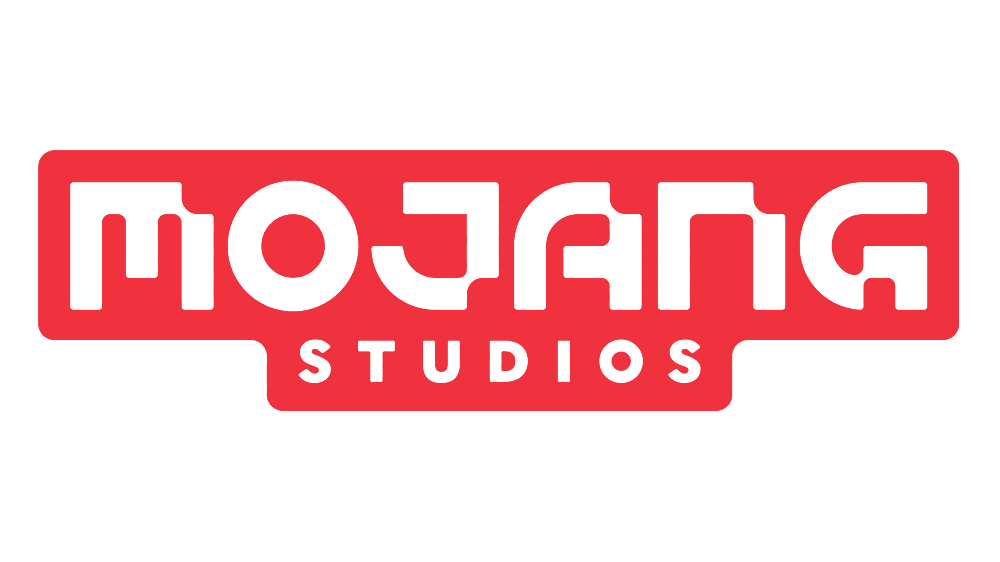

# Minecraft Retro

## Manual de usuario

Si desea acceder a un manual para el uso de el juego  pulse [aquí](./docs/MANUALDEUSUARIO.md)

## Descripción de las clases

Si quiere acceder a una descripción de las clases del proyecto pulse [aquí](docs/DESCRIPCIONDECLASES.md)

## Estructura de paquetes

La estructura de paquetes es la siguiente

- `src`: Dentro tiene todos las clases del proyecto.
- `net`: Dominio .
- `salesianos`: Organización
- `mojang`: Organización que nos contrata.
- `entidades`: Paquete que contiene las clases abstractas Mob, MobHostil y MobPacifico además de la clase Personaje.
- `mobs`: Contiene 3 clases de mobs creados a partir de las clases abstractas MobHostil y MobPacifico.
- `interfaces`: Este paquete contiene las interfaces usadas en los combates entre Mobs y el personaje
- `docs`: Contiene el manual de usuario y la descripción de las clases.
- `images`: Contiene las imágenes usadas en los documentos.

