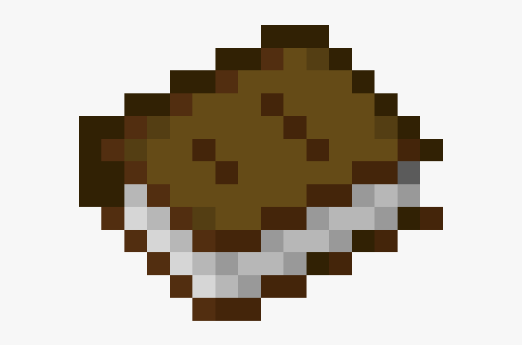
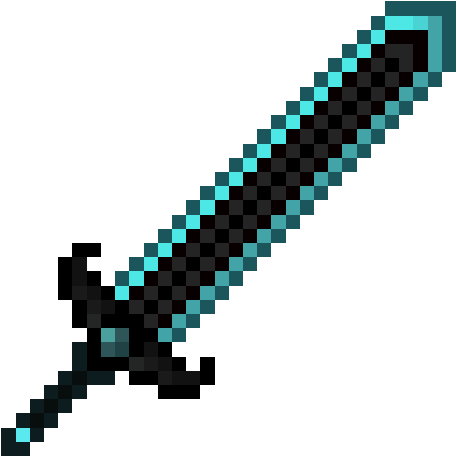
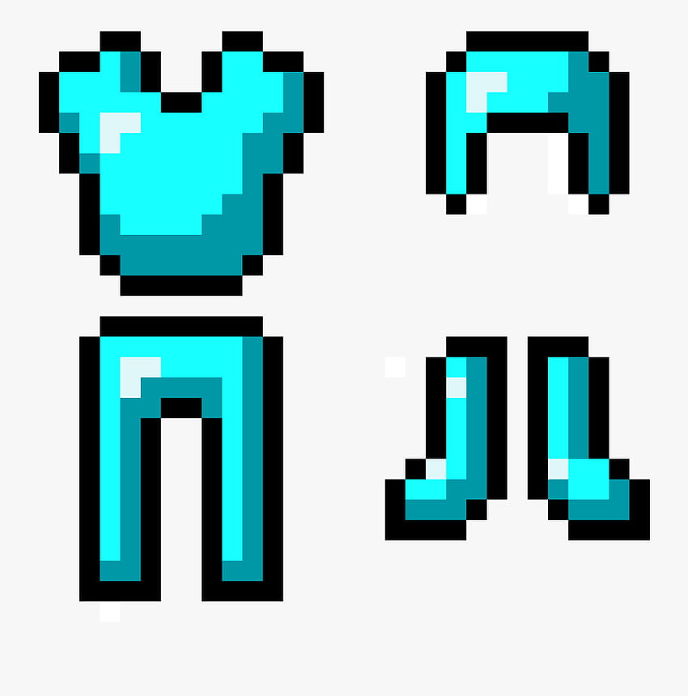
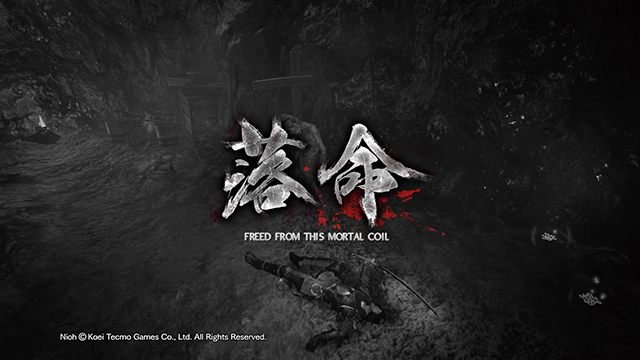

# Diario para aventureros

## Saludos jugador

Si acudes a este diario es porque necesitas una pequeña guía para emprender tu viaje con buen pie.

Al entrar has debido de ver un saludo, lo siguiente será elegir tu equipamiento, tu arma y tu armadura.

**Arma:** Tendrás 4 opciones ir a mano desnuda como un valiente (o un tonto vease como guste) o con espadas a mayor rareza del material del que este hecha mas daño hará.

**Arnadura:** Tendrás 4 opciones ir a pecho descubierto como un valiente (o un tonto vease como guste) o con armadura a mayor rareza del material del que este hecha mas daño recibido mitigara.

**Combate:** 

En el combate tu personaje solo atacará el enemigo podrá atacarte o moverse, en cualquier caso recibirá daño. El combate terminará cuando alguna de las dos partes haya sido derrotada.

**Si muertes**

**Has sido liberado es esta espiral mortal.**

Si desea volver al readme pulse [aquí](../README.md)